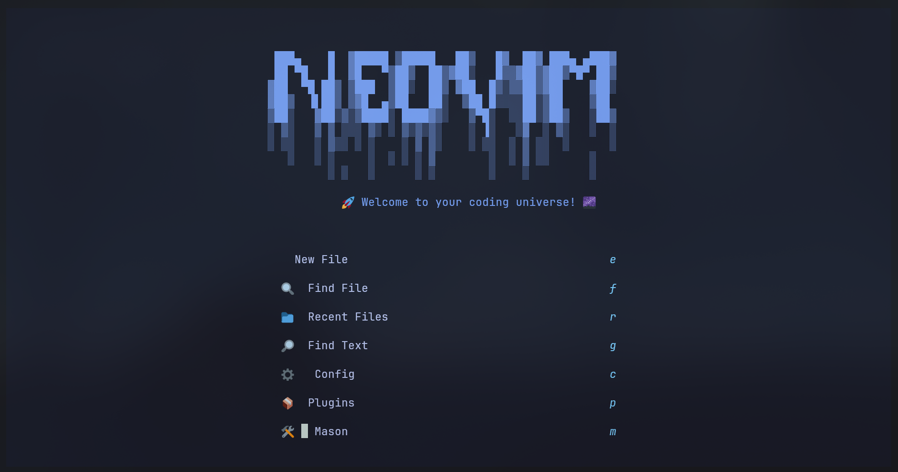
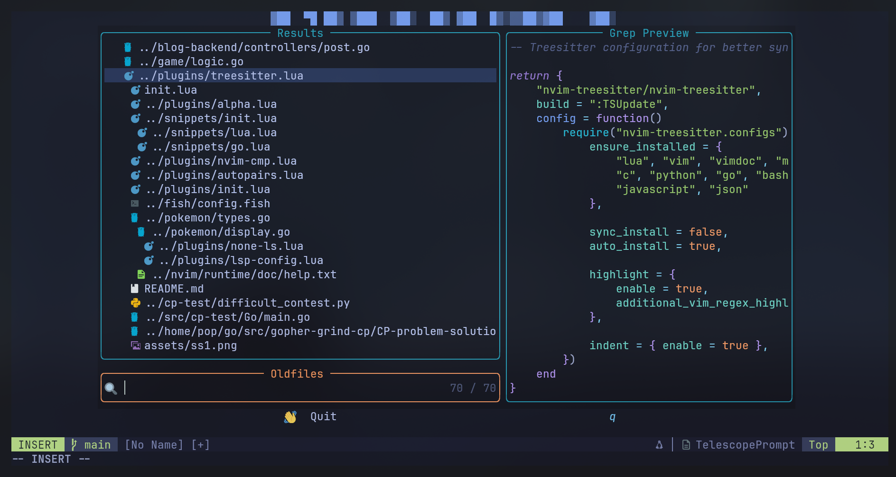
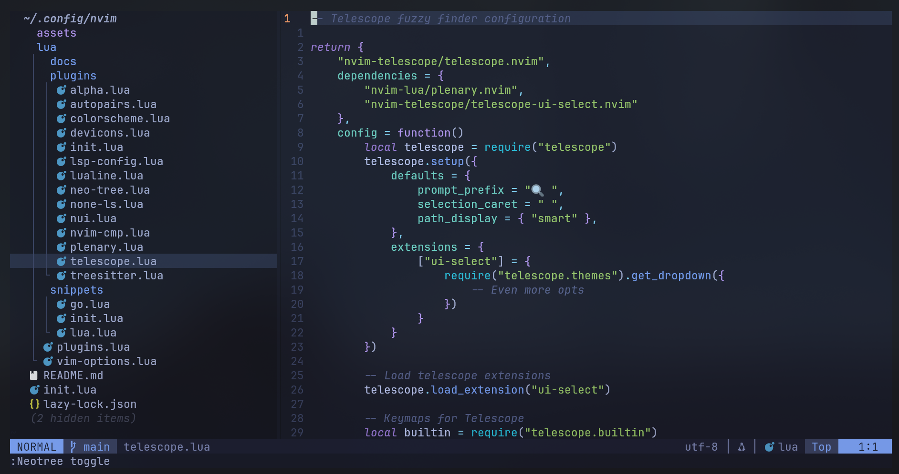

# 🚀 My Sexy Neovim Setup

> **Status:** ✨ Production Ready - Clean, modular, and blazing fast!

A comprehensive, modern Neovim configuration built for speed, efficiency, and developer productivity with full LSP support, intelligent autocompletion, and a beautiful interface.

## ✨ Features

- **🌙 Tokyo Night** - Beautiful dark theme
- **🌳 Neo-tree** - Powerful file explorer with Git integration
- **🔍 Telescope** - Lightning-fast fuzzy finder
- **🌲 Treesitter** - Superior syntax highlighting
- **📊 Lualine** - Beautiful status line
- **🧠 LSP Support** - Full Language Server Protocol (Lua, Go, Python)
- **💡 Autocompletion** - Intelligent code completion with snippets
- **🎯 Auto-formatting** - Code formatting on save
- **🏠 Alpha Dashboard** - Beautiful startup screen
- **🤖 Auto-pairs** - Smart bracket completion
- **⚡ Lazy.nvim** - Fast plugin management
- **📁 Modular Structure** - Each plugin in its own file

## 🚀 Quick Start

1. **Backup existing config**:

   ```bash
   mv ~/.config/nvim ~/.config/nvim.backup
   ```

2. **Clone this repository**:

   ```bash
   git clone https://github.com/ifrunruhin12/nvim-config.git ~/.config/nvim
   ```

3. **Launch Neovim** and let plugins install automatically:

   ```bash
   nvim
   ```

4. **Restart Neovim** to ensure everything loads properly

## 🎮 Essential Key Bindings

| Category    | Key         | Action               |
| ----------- | ----------- | -------------------- |
| **General** | `<Space>w`  | Save file            |
|             | `<Space>q`  | Quit                 |
| **Files**   | `<Space>e`  | Toggle file explorer |
|             | `<Space>ff` | Find files           |
|             | `<Space>fg` | Search in files      |
| **LSP**     | `gd`        | Go to definition     |
|             | `K`         | Show documentation   |
|             | `<Space>f`  | Format code          |
|             | `<Space>ca` | Code actions         |

_For complete keybinding reference, see individual plugin guides below._

## 📚 Documentation

### Plugin Guides

- [🧠 LSP Configuration](lua/docs/lsconfig.md) - Language servers, keybindings, troubleshooting
- [🌳 Neo-tree Guide](lua/docs/neotree.md) - File explorer usage and shortcuts
- [💡 Autocompletion Guide](lua/docs/autocompletion.md) - nvim-cmp, snippets, and completion
- [🌲 Treesitter Guide](lua/docs/treesitter.md) - Syntax highlighting and parsing
- [🔍 Telescope Guide](lua/docs/telescope.md) - Fuzzy finding and searching
- [🎯 Formatting Guide](lua/docs/formatting.md) - Auto-formatting with none-ls

### Configuration Guides

- [⚙️ Customization Guide](lua/docs/customization.md) - Adding plugins, servers, and keymaps
- [🛠️ Troubleshooting Guide](lua/docs/troubleshooting.md) - Common issues and solutions

## 🏗️ Project Structure

```
~/.config/nvim/
├── assets                 # Screenshots
├── init.lua               # Main entry point
├── lua/
│   ├── vim-options.lua    # Core Vim settings
│   ├── docs/              # Documentation guides
│   ├── snippets/          # Custom code snippets
│   └── plugins/           # Modular plugin configurations
└── README.md              # This file
```

## 🚀 Performance

- **Fast startup**: Lazy loading and optimized plugin order
- **Smart caching**: Efficient completion and search
- **Minimal overhead**: Only essential features loaded

## Screenshots





---

**📖 For detailed usage instructions, troubleshooting, and customization options, please refer to the individual guides in the [lua/docs/](lua/docs/) folder.**

_Built with ❤️ for productive coding_ ⚡
